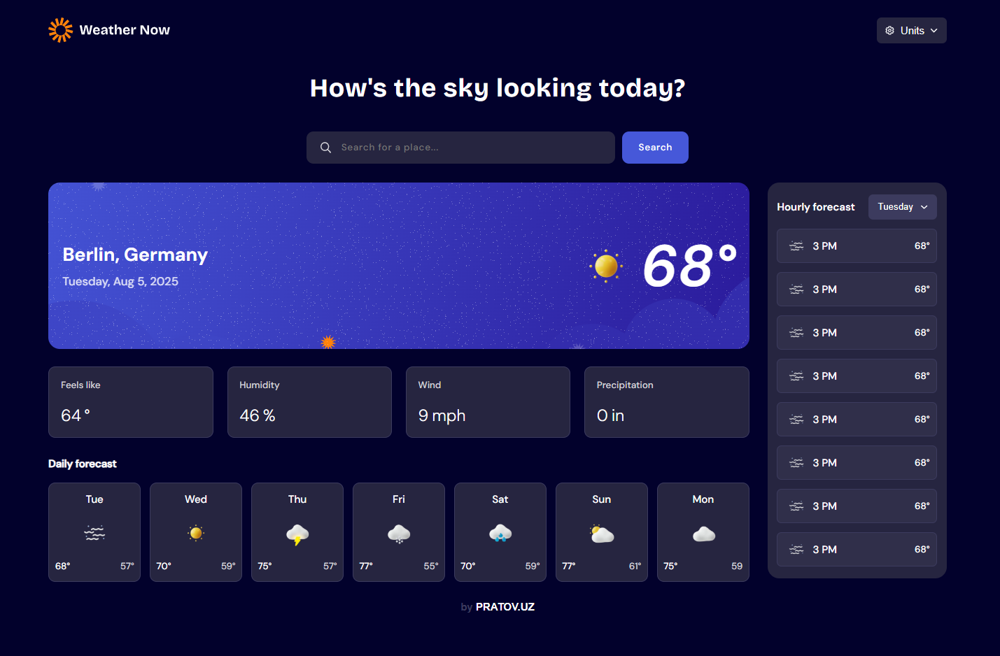

# Weather app - pratov.uz

This is a solution to the [Weather app challenge on Frontend Mentor](https://www.frontendmentor.io/challenges/weather-app-K1FhddVm49). 

## Table of contents

- [The challenge](#the-challenge)
- [Screenshot](#screenshot)
- [Links](#links)
- [Built with](#built-with)
- [Author](#author)

## The challenge

Users should be able to:

- Search for weather information by entering a location in the search bar  
- View current weather conditions including temperature, weather icon, and location details  
- See additional weather metrics like "feels like" temperature, humidity percentage, wind speed, and precipitation amounts  
- Browse a 7-day weather forecast with daily high/low temperatures and weather icons  
- View an hourly forecast showing temperature changes throughout the day  
- Switch between different days of the week using the day selector in the hourly forecast section  
- Toggle between Imperial and Metric measurement units via the units dropdown  
- Switch between specific temperature units (Celsius and Fahrenheit) and measurement units for wind speed (km/h and mph) and precipitation (millimeters) via the units dropdown  
- View the optimal layout for the interface depending on their device's screen size  
- See hover and focus states for all interactive elements on the page  

## Screenshot

## Links

- Solution URL: [Github](https://github.com/xpratov/)  
- Live Site URL: [Vercel](https://vercel.com/)  

## Built with

- Semantic HTML5 markup  
- Flexbox  
- CSS Grid  
- Mobile-first workflow  
- [React](https://reactjs.org/) - JS library  

## Author

- Website - [pratov.uz](https://pratov.uz)  
- X (Twitter) - [@xpratov](https://x.com/xpratov)  
- Telegram - [@xpratov](https://t.me/xpratov)  
- LinkedIn - [@pratov](https://www.linkedin.com/in/pratov)  
- Instagram - [@xpratov](https://www.instagram.com/xpratov)  
